## Running Maven builds, Unit Tests and Code Coverage with VSTS

Building your Java project with Maven
-------------------------------------

In this exercise, you will learn how to create a Team Build that runs in
Visual Studio Team Services. This makes it quick and easy to start
building your code, either manually or in an automated fashion, without
having to worry about any build server configuration.

### Creating a new build definition

1.  To the right of the master branch, click the **setup now** button.

    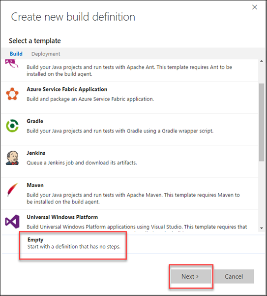

2.  In the **Create a new build definition** dialog, select the
    > **Empty** definition at the bottom and click **Next.**

    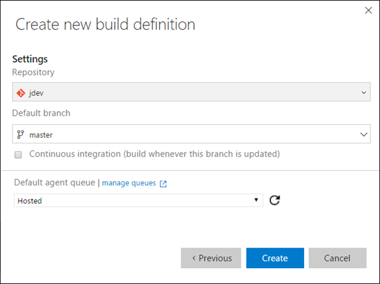

1.  On the next page, you’ll see you can configure repo and
    > branch settings. Accept the defaults and click **Create**.

    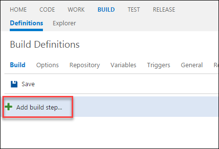

    Visual Studio Team Services creates the new empty build definition
    and opens a new browser tab in the Build hub where you can continue
    editing the build.

2.  Click the **Add build step** button.

    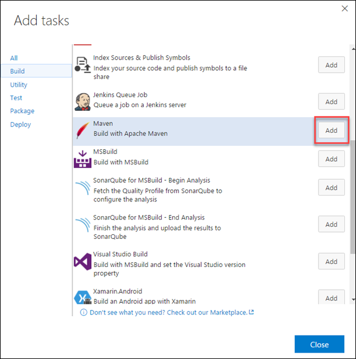

1.  In the Add Tasks dialog, scroll the list of **Build** tasks and
    > select the **Maven** build task and click **Add**.

    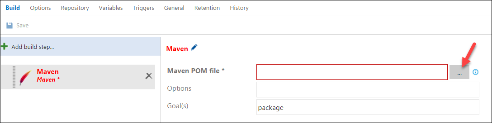

1.  Click **Close**.

2.  Click the **…** button at far right of the **Maven POM
    file** option.

    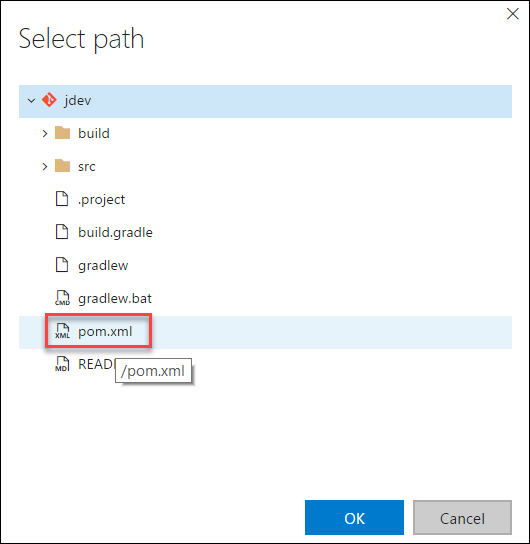

1.  In the Select Path dialog, select the **pom.xml** file and click
    **OK**.

    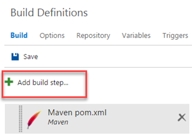

1.  Click **Add build step**.

    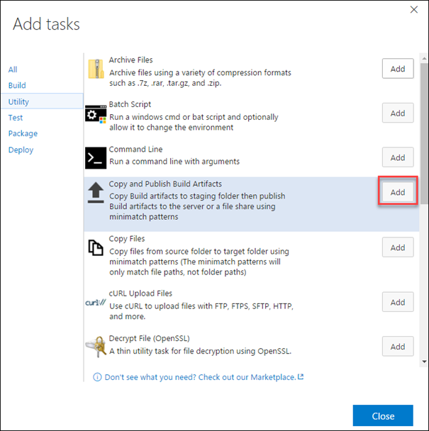

1.  First click the **Utility** link.

2.  Next click **Add** for the **Copy and Publish Build
    Artifacts** task.

    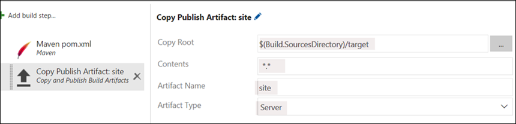

1.  Close the **Add Tasks** dialog.

2.  Select the Copy and Publish Build Artifacts build step.

3.  Edit the settings to look as follows:

    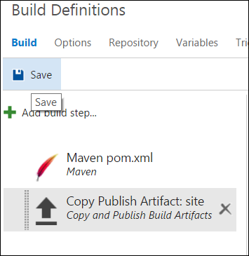

1.  Click the **Save** button to save your build definition.

    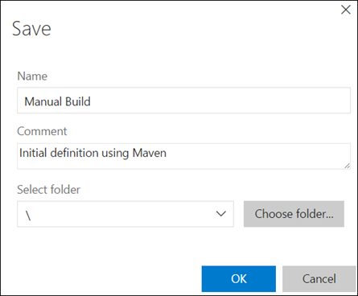

1.  In the SAVE dialog type **Manual Build** for the **Name**.

2.  In the **Comment** field, enter **Initial definition using Maven**.
    A great feature of builds is that VSTS versions your build
    definitions so you can see when and why a change was made and once
    you have two or more, you can diff the JSON-based definition.
    Click **OK**.

    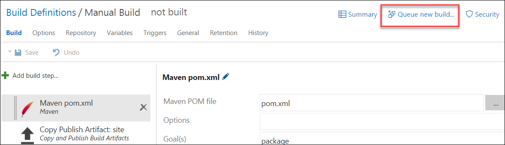

1.  Click the **Queue build** button to start a build. Right now you’ll
    use the hosted build service in the Azure cloud.

    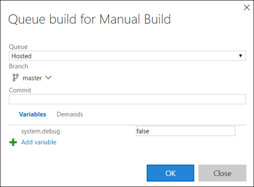

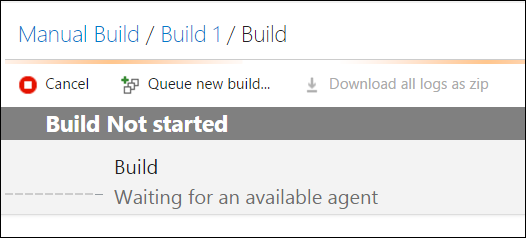

1.  Click **OK** to queue the build.

    VS Team Services with queue the build and keep you posted on
    its progress.

    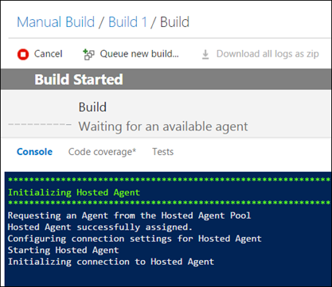

    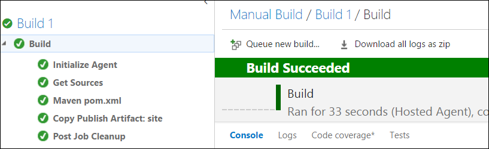

1.  Monitor the build until it completes. It will take a couple
    > of minutes. You can monitor the progress in the Console window.

    

1.  Once it’s done, you examine the build details by click the “Build
    \#” link where \# is the build run number (in the preceding screen
    shot it’s a 1).

2.  The build report will tell you lots of details including related
    commits, associated work items, and unit test results.

    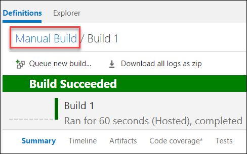

### Running Unit Tests

1.  Notice the **Test Results**. The unit tests were executed as a part
    of the Build and the test results are published back to VSTS since
    by default, the **Publish to VSTS/TFS** option is checked

    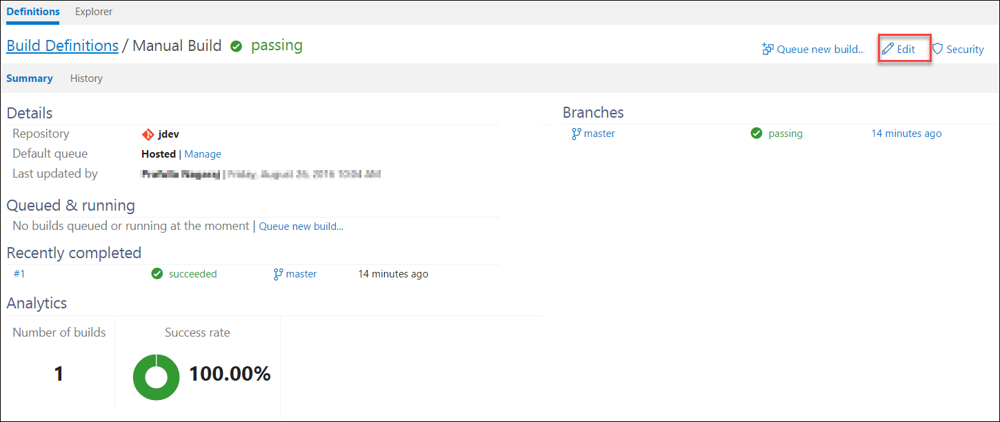

2.  Selecting the **Detailed Report** in the **Test Results** section
    will take you to the **Tests** tab on the Build Results page.
    Here, you can see

-   Aggregate summary for total tests, failed tests, pass percentage and
    test duration, giving you a consolidated status across all
    test runs.

-   Break up of test failures into ‘New’ and ‘Existing’ failures. New
    failures are tests that were passing in previous build but are
    failing in the current build. These will help you identify
    regressions introduced in the current build.

    By default, the **Outcome** filter is set to ***failed*** showing
    only test cases that failed. Changing the filter to ***all*** will
    show all test cases.

    **  
    **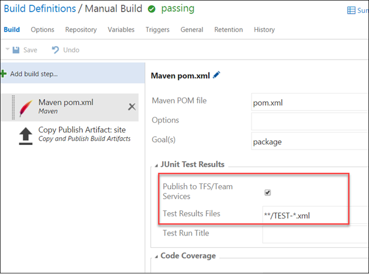**  
    **

<pre> **Note**: For failed tests, the details pane will show the error message and the stack trace to 
help you investigate the cause of the failure. The graph above the details pane will show the outcome 
trend of the tests that can help you quickly identify if the tests fail intermittently.

You can also file a new bug (or associate an existing bug) for failed tests. When you file a new bug, the 
bug work item will be auto-populated with information like error and stack of the failing test.
</pre>

### Enabling Code Coverage 
-----------------------------------------

Teams use code coverage data to measure the effectiveness of the test
and identify the parts of the source code that are not tested or
executed. With VSTS, enabling code coverage is a simple task. You only
need to specify what tool you want to use for running code coverage.
Currently, VSTS supports **Jacoco** and **Cobetura** for Java projects.

-   [**Jacoco**](http://eclemma.org/jacoco/) is an open source tool for
    measuring and reporting Java code coverage. It provides coverage
    analysis of instructions, branches, lines, classes, methods, types
    and yclomatic complexity.

-   [**Cobetura**](http://cobertura.github.io/cobertura/) is an another
    free Java tool that calculates the percentage of code accessed
    by tests. It measures branch and line coverage .

<pre>Note that if you are using <b>hosted</b> agent for your build, Jacoco and Cobetura add-ins will be pulled automatically by the agent. 
You will just need to select the tool you want to use for code coverage!

If you use other local private agents, you will need to manage this yourself by adding the plug-ins to your maven file.</pre>

1.  Let’s add code coverage to our Build definition now. Modify your
    build definition and select **Jacoco** as the code coverage tool.
    Note that for **Options** in the Maven section, we have specified
    the tests that we want to run. If you want to run all the tests,
    you can simply omit this parameter.

    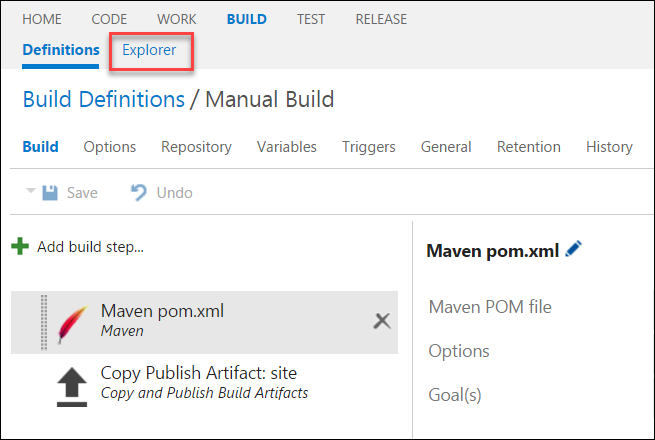

2.  Save the build definition and queue a new build. Make sure you have
    selected **Hosted** agent for the build job.

3.  When the build is complete, you will notice the code coverage
    section is now filled with information showing coverage on Branch,
    Class, Complexity, etc. You can download the complete report by
    selecting the **Download Code Coverage Results** link.

    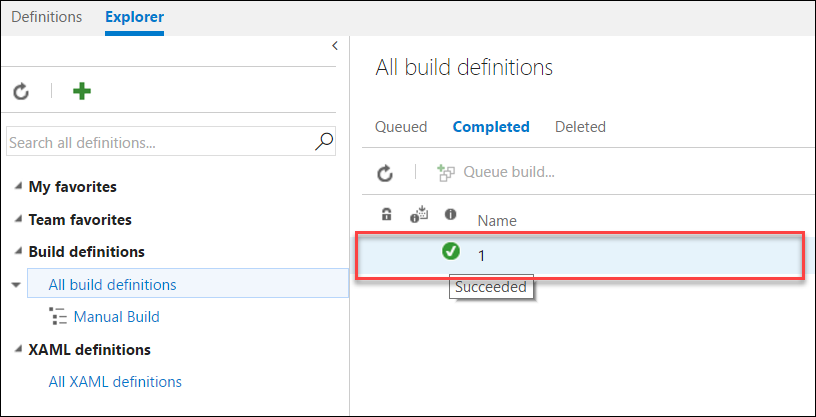

4.  Save and extract the zip file to a local folder. Open the folder
    where you extracted the zip file and open the **index.html** file

    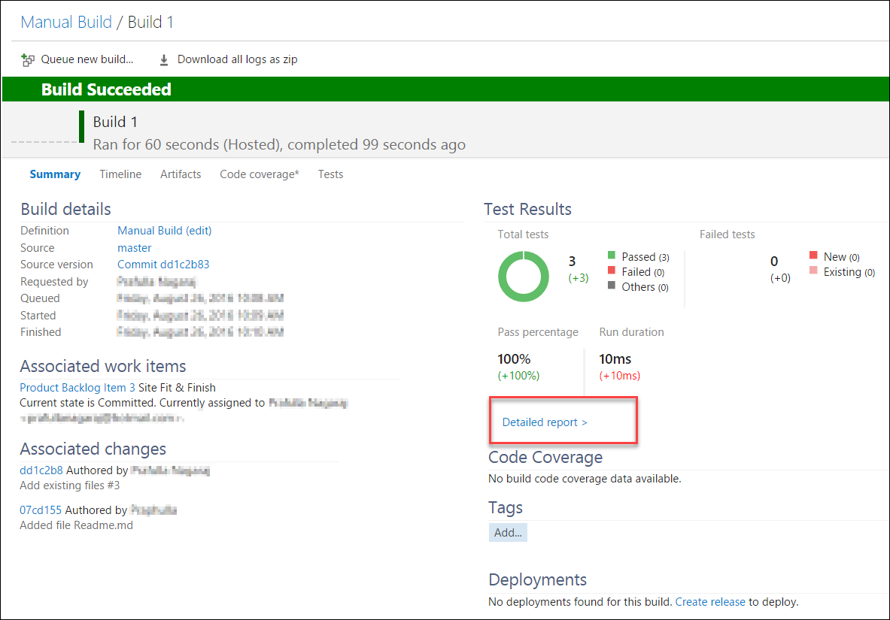

5.  Select **com.microsoft.example.models** and then **Employee** and
    finally **getTotalFees(List)**. You will see the codes covered

    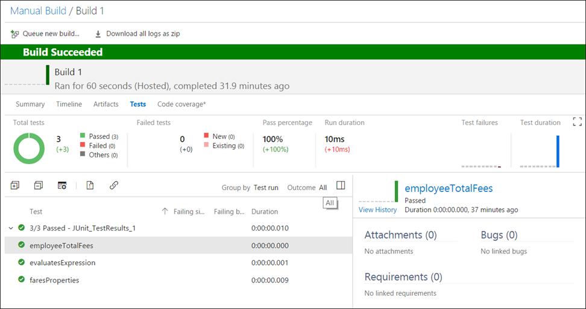

