## Working with Git

Adding existing code to Git
---------------------------

In this exercise, you are going to learn how to put some existing code
into your Team Project. This exercise assumes you have completed
Exercise 1, and have created a Team Project that uses Git for version
control and have completed Exercise 2 where you’ve defined some work
items. This exercise uses a team project named **jdev**, though your
team project name may differ.

1.  Open Eclipse from the Launcher by clicking on the **Eclipse** icon.

    

2.  When the **Workspace Launcher** appears, you can accept the default
    folder or select another one. This is where Eclipse will store
    your projects. You can select the **Use this as the default and do
    not ask again** option if you want Eclipse to remember the folder
    and do not prompt every time on startup.

    Select **OK** when you are done.

    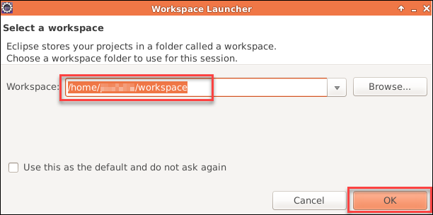

3.  Open the **Team Foundation Server Explorer** perspective. To open
    the Team Foundation Server Exploring perspective:

    1.  On the **Window** menu, point to **Open Perspective**, and click
        **Other**.

    2.  In the **Open Perspective** dialog box, click **Team Foundation
        Server Exploring**, and then click **OK**.

        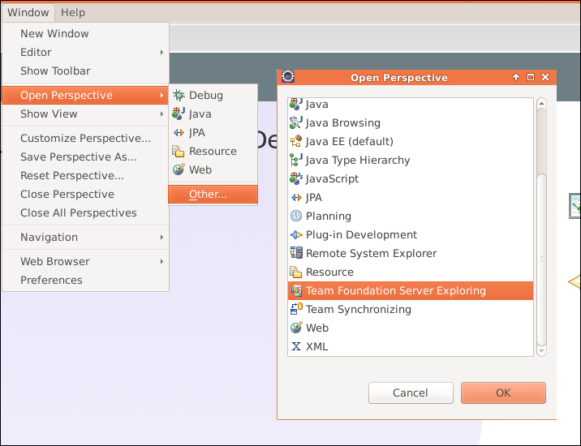

<pre><b>Note:</b> A perspective defines the initial set and layout of views in the Workbench window. 
You can create new or customize existing perspectives. If you want to know more, you might find this
[tutorial](http://www.tutorialspoint.com/eclipse/eclipse_perspectives.htm) helpful </pre>

1.  If necessary, click the Home icon. Click the **Connect to Team
    > Foundation Server** link.

    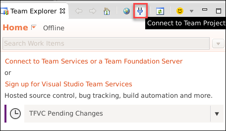

1.  In the **Add Existing Team Project** dialog, click the
    **Servers** button.

    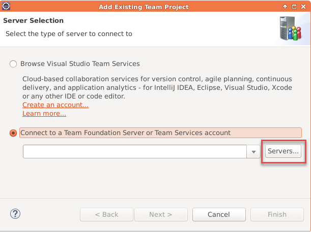

1.  In the **Add/Remove Team Foundation Server** dialog, click the
    **Add** button on the right. Enter the name of your Visual Studio
    Team Services account plus **.visualstudio.com**. For example, if
    your account name is *javadev*, you would enter
    *javadev.visualstudio.com* (without any http or https). Once
    you’ve entered your account name, click **OK**.

    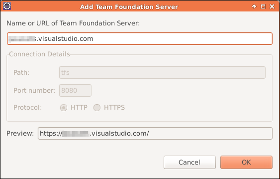

2.  In the login dialog that appears, enter your alternate username and
    password and click **OK**.

    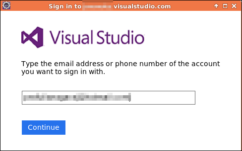

3.  Choose the **Team Project** (jdev) and select **Finish**

    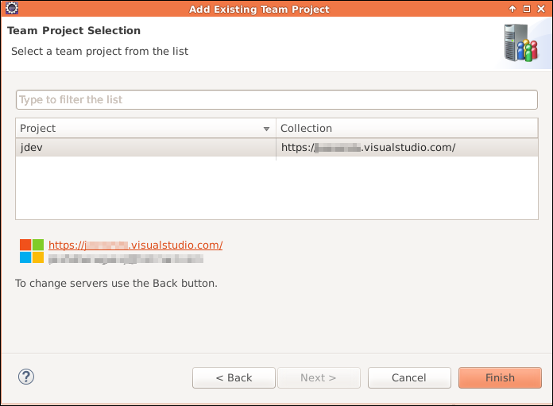

4.  Eclipse will open a Secure Storage dialog. Enter a password and
    confirm it in the dialog and click **OK**.

<pre>Eclipse stores the connection information in an encrypted form in a
storage file that is stored with a predefined password. Make sure you
can remember this password. Eclipse will offer to allow you to save
password hints for password recovery. Click Yes or No depending upon
your needs.</pre>

1.  Now click **Close** in the **Add/Remove Team Foundation Server** dialog.

2.  In the **Add Existing Team Project** dialog, select the **Default
    Collection** and then select your **jdev** Team Project from the
    list and click **Finish**.

3.  Upon successful connection, you will see Team Explorer window
    showing source control, work items, build and settings menu.

    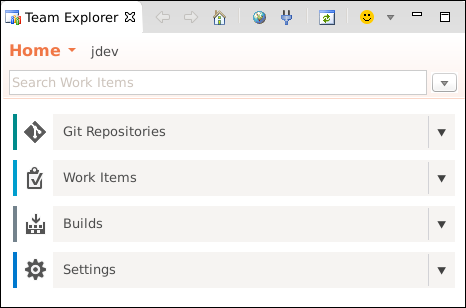

Cloning Git Repository
----------------------

1.  In the **Team Explorer** window, click the **Git
    Repositories** tile.

2.  In the list of repositories, select the bottom **jdev** node.

    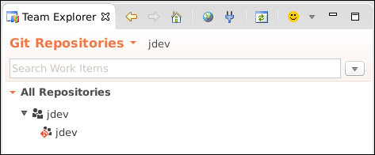

1.  Right-click on the **jdev** node and select **Import Repository**.

    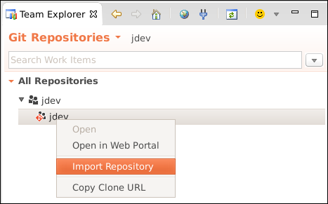

In the dialog that opens click **Next**.

    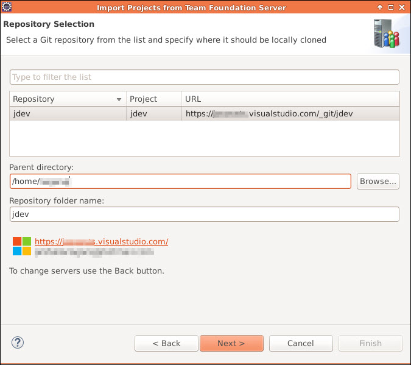

1.  In the Import Projects from Team Foundation Server dialog,

    -   Change the **Destination** to use the **Location** option and
        select user’s home folder.

    -   In the **Authentication** group, provide your alternate
        credentials you created in Exercise 1, step 22. Feel free to
        place a check next to **Save password**. Click **Next**
        when ready.

        

2.  On the **Clone Summary** page, click **Next**.

    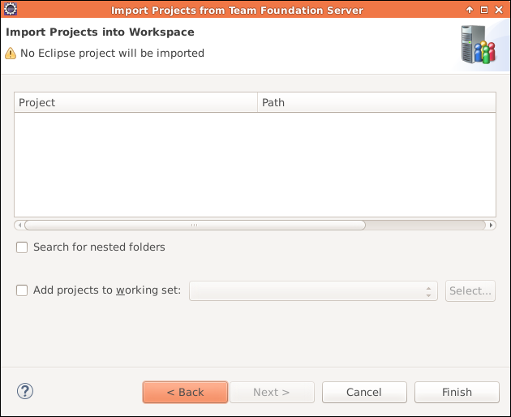

1.  Enter your alternate credentials when prompted and click **OK**.

2.  On the **Select Project Import Wizard** page, click **Next**.

    

3.  You don’t have any existing Eclipse projects so just click
    **Finish**.

    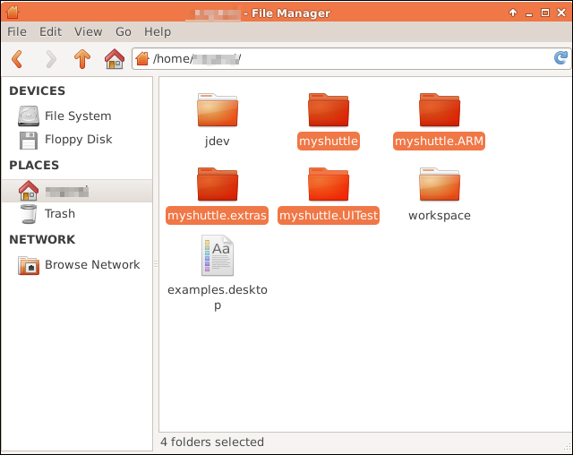

    At this point you’re going to add the sample code already installed
    on the VM and copy it into your local repo where you’ll then commit
    and then push up to VS Team Services.

4.  Open File Manager and navigate to the **/home/vmadmin** folder. Copy
    all of the **myshuttle** folders – myshuttle, myshuttle.extras,
    myshuttle.UITest, myshuttle.ARM

    

5.  Copy or move them to your home folder **(/home/&lt;user name&gt;**)

    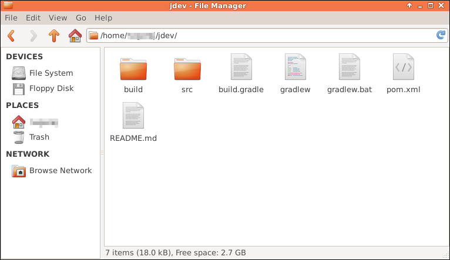

6.  Open myshuttle folder. Select all the files in the folder. Right
    click and select **Copy**

    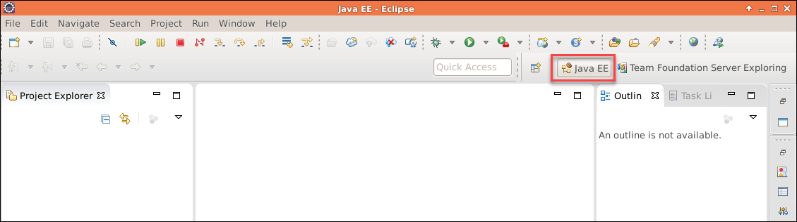

7.  Go to the **jdev** folder and paste the copied files

    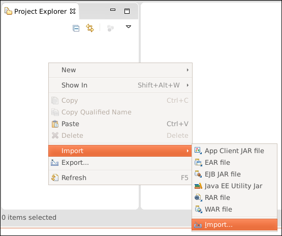

8.  Return back to Eclipse.

9.  Activate the **Java EE** Perspective by click its button in the
    upper right corner, to the left the **Team Foundation Server
    Explorer** button.

    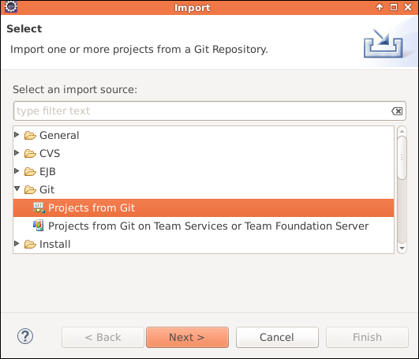

1.  Right-click in the **Project Explorer** and select **Import |
    Import**.

    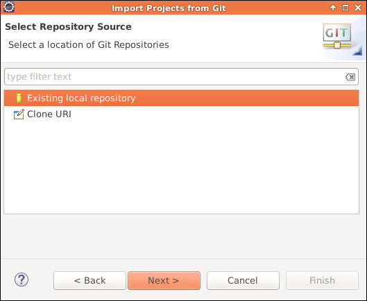

1.  In the **Import** dialog, select **Projects from Git** from under
    the **Git** node and select **Next.**

    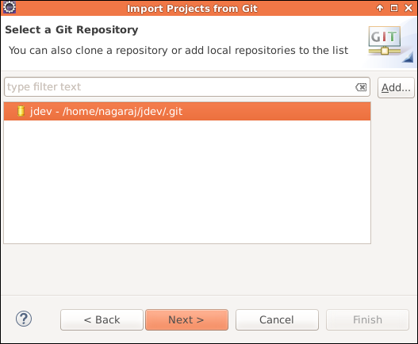

1.  Select **Existing local repository** and click **Next.**

    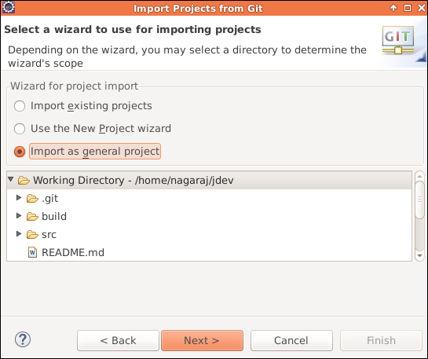

1.  Select **jdev** from the list and click **Next**.

    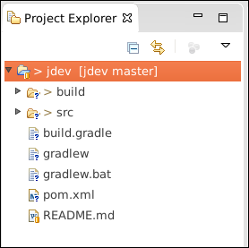

2.  Select import as general project.

    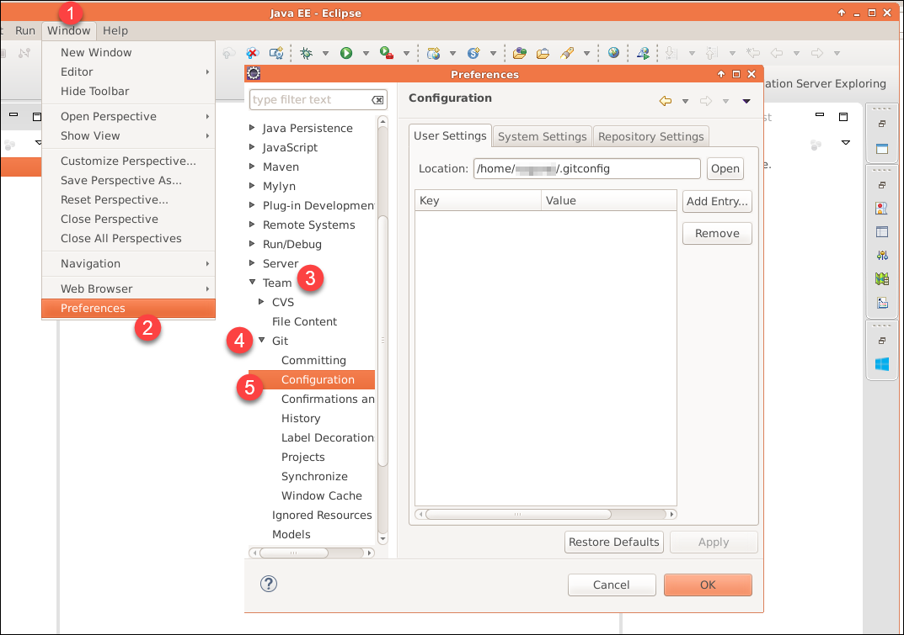

1.  Click **Next** and then click **Finish** on the final page.

2.  You should be able to see the project now in the **Project
    Explorer** window.

    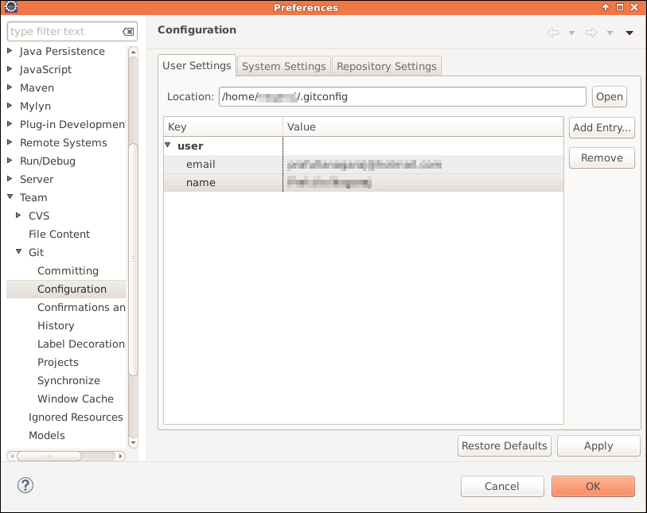

Configuring User Name and Email for Git
---------------------------------------

Now before you can commit artifacts to the local repo and the push to VS
Team Services, you need to configure your user name and e-mail address
for Git in Eclipse.

1.  Select **Window | Preferences**. Under the **Team** node, select
    **Configuration** under the **Git** node.

2.  On the **Configuration** page, click **Add Entry**. In the resulting
    > dialog, enter **user.name** in the **Key** field and in the
    > **Value** field, enter your *display name* and click **OK**.

3.  Click **Add Entry** again to make another entry. Enter
    **user.email** in the **Key** field and in the **Value** field,
    enter your *e-mail address* and click **OK**.

    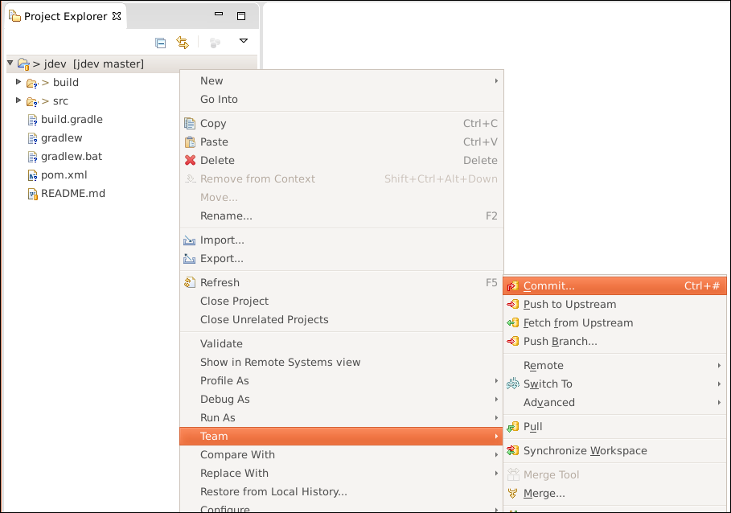

4.  Click **OK** to save your preferences.

<pre>You’re now ready to take your local changes and commit them locally and then push them up to 
your remote repository in Visual Studio Team Services.</pre>

Committing changes to Git
-------------------------

1.  In the **Project Explorer**, right click on the root node and select
    **Team | Commit**. You can alternatively press **CTRL+\#** key

    

1.  In the **Commit Changes** dialog, enter a commit message like **Add
    existing files** followed by \#123 where 123 is the Work Item ID
    for one of your PBIs. If you don’t remember the Work Item ID,
    switch over to your open web browser and take a look at the
    Backlog or Task Board.

2.  In the Files section click the
     button to
    select all the files.

3.  Now click **Commit and Push**.

    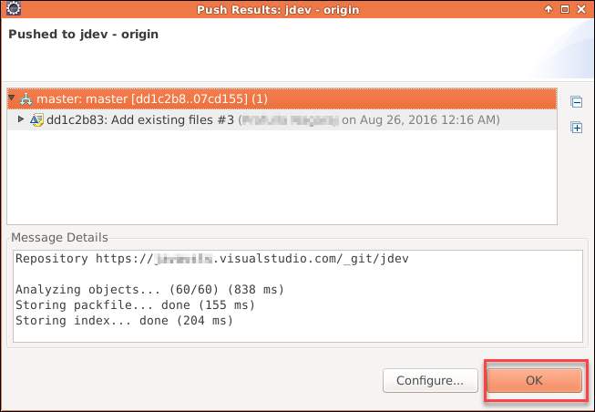

1.  Once the process is complete, click **OK** to close the **Push
    Results** dialog.

    Let’s see what you can see using the Visual Studio Team Services
    website for the project. Switch back to your web browser.

2.  Click the **Code** link at the top. You can see the code you just
    pushed into the repository.

> 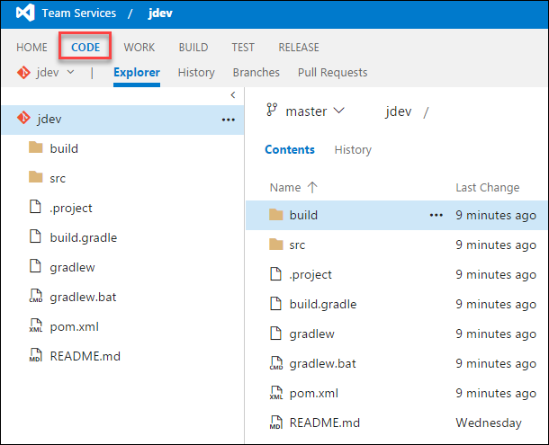

1.  Click the **History** tab to see the information on the push you
    just performed.

2.  Click the **Explorer** link, and then expand the **src** folder
    under the **jdev** root until you find the **DataAccess.java**
    file (jdev/src/main/java/com/microsoft/example). Select that file.

    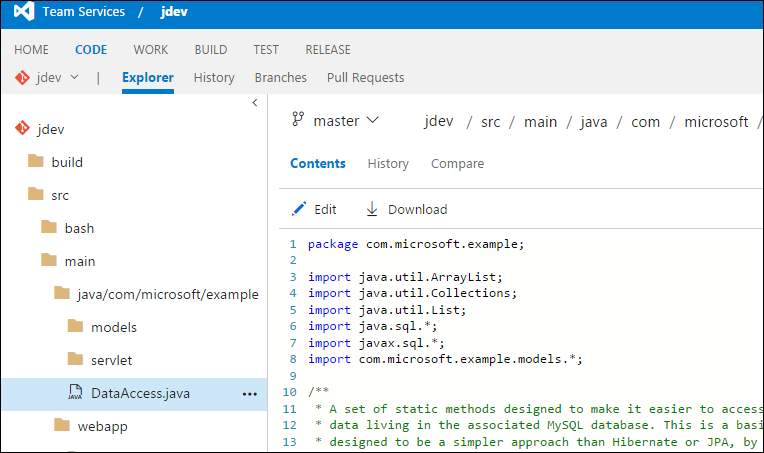

1.  You can easily browse the file. As you can see Visual Studio Team
    Services understands that this is a particular type of file and
    applies syntax formatting.

2.  Select the root **jdev** node.

3.  Leave your browser open and on the current page. Continue to the
    next exercise where you’ll configure a Team Build.

